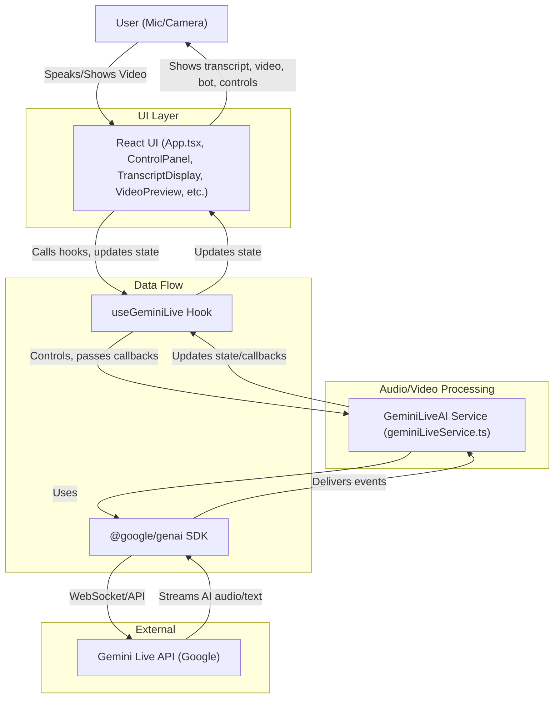

# Gemini Live Assistant

An AI-powered voice and video live assistant using the Gemini API, enabling real-time conversation and video interaction. This project demonstrates a modern, full-stack approach to streaming AI audio/video, transcript display, and user interaction in the browser.

---

## Table of Contents
- [Features](#features)
- [Architecture Diagram](#architecture-diagram)
- [How It Works](#how-it-works)
- [Setup & Running Locally](#setup--running-locally)
- [Project Structure](#project-structure)
- [Key Modules & Functions](#key-modules--functions)
- [Transcript & Data Flow](#transcript--data-flow)
- [Packages Used](#packages-used)
- [Contributing](#contributing)

---

## Features
- Real-time voice and video streaming to Gemini Live API
- Live AI-generated audio and transcript responses
- User and AI transcript display with interim/final states
- Adjustable input/output volume controls
- System instruction (persona) customization
- Video preview and AI bot visualizer
- Robust error handling and reconnection logic

---

## Architecture Diagram



---

## How It Works

1. **User** grants microphone (and optionally camera) access and interacts via the UI.
2. **App.tsx** orchestrates the UI, state, and integrates the `useGeminiLive` hook.
3. **useGeminiLive** manages all AI session state, transcript throttling, and exposes control functions (start/stop/reset recording, set video, etc.).
4. **GeminiLiveAI** (in `services/geminiLiveService.ts`) manages:
   - Connecting to Gemini Live API via `@google/genai`
   - Audio/video capture, encoding, and streaming
   - Receiving and decoding AI audio responses
   - Handling transcript updates and session events
5. **Transcripts** (user and AI) are updated in real-time, with interim and final states, and displayed in the UI.
6. **Audio/Video** is processed and visualized (AI bot, video preview) in real time.

---

## Setup & Running Locally

**Prerequisites:** Node.js (18+ recommended)

1. Install dependencies:
   ```sh
   npm install
   ```
2. Set your Gemini API key in `.env.local`:
   ```env
   GEMINI_API_KEY=your-google-gemini-api-key
   ```
3. Run the app:
   ```sh
   npm run dev
   ```

---

## Project Structure

```
/ (root)
├── App.tsx                  # Main app component
├── components/              # UI components (ControlPanel, TranscriptDisplay, VideoPreview, etc.)
├── hooks/
│   └── useGeminiLive.ts     # Main hook for AI session and state
├── services/
│   └── geminiLiveService.ts # Core GeminiLiveAI class (API, audio/video, transcripts)
├── utils/
│   └── audioUtils.ts        # Audio encoding/decoding helpers
├── types.ts                 # TypeScript types/interfaces
├── constants.ts             # App-wide constants
├── index.tsx, index.html    # Entry points
└── ...
```

---

## Key Modules & Functions

### App.tsx
- Orchestrates UI, state, and integrates `useGeminiLive`.
- Handles user actions (start/stop/reset, system instruction, video toggle).

### hooks/useGeminiLive.ts
- Custom React hook for all Gemini Live session logic.
- Exposes:
  - `startRecording(initialVideoState?)`
  - `stopRecording()`
  - `resetSession()`
  - `setVideoTrackEnabled(enable)`
  - Transcript state: `userTranscript`, `modelTranscript`, `isFinal` flags
  - Audio contexts and gain nodes for volume control
- Handles transcript throttling for smooth UI updates.

### services/geminiLiveService.ts
- `GeminiLiveAI` class:
  - Connects to Gemini Live API using `@google/genai`
  - Manages audio/video capture, encoding, and streaming
  - Handles AI audio playback and transcript updates
  - Provides methods:
    - `startRecording(initialVideoEnabled?)`
    - `stopRecording()`
    - `reset()`
    - `setVideoTrackEnabled(enable)`
    - `dispose()`
    - `getInputNode()`, `getOutputNode()`

### utils/audioUtils.ts
- Audio encoding/decoding helpers:
  - `encode(bytes: Uint8Array): string`
  - `decode(base64: string): Uint8Array`
  - `createBlob(data: Float32Array): AudioDataPart`
  - `decodeAudioData(data: Uint8Array, ctx: AudioContext, sampleRate: number, numChannels: number): Promise<AudioBuffer>`

### components/
- UI for control, transcript, video, bot visualization, status, etc.

---

## Transcript & Data Flow

- **User speaks** → Audio is captured, encoded, and streamed to Gemini API.
- **Gemini API** transcribes user audio and generates AI response (audio + transcript).
- **GeminiLiveAI** decodes and plays AI audio, updates transcript state via callbacks.
- **useGeminiLive** manages transcript state, throttling, and exposes to UI.
- **TranscriptDisplay** shows both user and AI transcripts, with interim/final states.

---

## Packages Used
- [`@google/genai`](https://www.npmjs.com/package/@google/genai): Google Gemini API SDK
- [`@modelcontextprotocol/sdk`](https://www.npmjs.com/package/@modelcontextprotocol/sdk): Required peer dependency for GenAI
- `react`, `react-dom`: UI framework
- `vite`: Build tool
- TypeScript: Type safety

---

## Contributing

1. Fork and clone the repo
2. Create a feature branch
3. Make your changes (see [Project Structure](#project-structure) and [Key Modules & Functions](#key-modules--functions))
4. Test locally
5. Submit a pull request

---

## License
MIT
