# Gemini Live Assistant

An advanced AI-powered voice and video live assistant using Google's Gemini Live API, featuring real-time conversation, video interaction, session management, and comprehensive analytics. This project demonstrates a modern, full-stack approach to streaming AI audio/video with sophisticated persona management and data persistence.

---

## 🌟 Features

### 🎤 **Core Functionality**
- **Real-time voice and video streaming** to Gemini Live API
- **Live AI-generated audio and transcript responses** with interim/final states
- **13 AI Personas** with specialized system instructions and behaviors
- **Adjustable input/output volume controls** with real-time audio processing
- **Video preview and AI bot visualizer** with animated responses
- **System instruction customization** for personalized AI interactions

### 🎭 **AI Personas**
- **Interview Coach** - Professional interview simulation with STAR method feedback
- **Dating Coach** - Modern dating conversation practice and confidence building
- **Motivational Mentor** - High-energy goal setting and accountability
- **Friendly Conversationalist** - Warm, approachable chat companion
- **Tech Support Agent** - Patient troubleshooting and digital skills help
- **Language Tutor** - Conversation practice with corrections and cultural notes
- **Fitness Coach** - Personalized workout tips and motivation
- **Standup Comedian** - Humor, improvisation, and lighthearted interactions
- **Startup Advisor** - Entrepreneurial guidance and pitch feedback
- **Storytelling Companion** - Creative story creation and character roleplay
- **Mindfulness Guide** - Meditation, stress management, and calming techniques
- **Debate Partner** - Friendly debates and perspective exploration
- **Coding Buddy** - Programming help, debugging, and pair programming

### 💾 **Session Management**
- **Session recording and playback** with video/audio storage
- **Session history drawer** with thumbnail previews and metadata
- **Save/discard prompts** with automatic cleanup for unsaved sessions
- **Session analytics** with detailed metrics and insights
- **Batch session management** with select and delete functionality
- **Supabase integration** for data persistence and cloud storage

### 📊 **Analytics & Insights**
- **Real-time session analytics** with activity rings and charts
- **Persona-specific metrics** (e.g., STAR method usage, confidence scores)
- **Sentiment analysis** and engagement tracking
- **Session duration and frequency statistics**
- **Interactive data visualizations** using Recharts
- **Export capabilities** for session data

### 🎨 **UI/UX Features**
- **Modern, responsive design** with Tailwind CSS v4
- **Dark theme** with custom CSS variables and color palette
- **Accessibility features** including keyboard navigation and screen reader support
- **Loading states and error handling** with user-friendly feedback
- **Toast notifications** for user actions and system events
- **Responsive layout** optimized for desktop and mobile devices

---

## 🏗️ Architecture

```mermaid
flowchart TD
  User["👤 User (Mic/Camera)"]
  UI["🎨 React UI Components"]
  useGeminiLive["🔧 useGeminiLive Hook"]
  GeminiLiveAI["🤖 GeminiLiveAI Service"]
  GoogleGenAI["📡 @google/genai SDK"]
  GeminiAPI["🌐 Gemini Live API"]
  Supabase["🗄️ Supabase Database"]
  Storage["☁️ Supabase Storage"]

  User --> UI
  UI --> useGeminiLive
  useGeminiLive --> GeminiLiveAI
  GeminiLiveAI --> GoogleGenAI
  GoogleGenAI --> GeminiAPI
  GeminiAPI --> GoogleGenAI
  GoogleGenAI --> GeminiLiveAI
  GeminiLiveAI --> useGeminiLive
  useGeminiLive --> UI
  UI --> User

  GeminiLiveAI --> Supabase
  GeminiLiveAI --> Storage

  subgraph "AI Personas"
    Personas["13 Specialized Personas"]
    SystemInstructions["Custom System Instructions"]
  end

  subgraph "Session Management"
    SessionHistory["Session History"]
    Analytics["Analytics & Metrics"]
    Playback["Session Playback"]
  end

  subgraph "Real-time Features"
    AudioProcessing["Audio Processing"]
    VideoProcessing["Video Processing"]
    Transcripts["Live Transcripts"]
  end
```



---

## 🚀 Quick Start

### Prerequisites
- **Node.js** (18+ recommended)
- **Google Gemini API Key** ([Get one here](https://makersuite.google.com/app/apikey))
- **Supabase Account** (for session storage and analytics)

### Installation

1. **Clone the repository:**
   ```bash
   git clone https://github.com/yourusername/Gemini-Live-Assistant.git
   cd Gemini-Live-Assistant
   ```

2. **Install dependencies:**
   ```bash
   npm install
   ```

3. **Set up environment variables:**
   Create a `.env.local` file:
   ```env
   GEMINI_API_KEY=your-google-gemini-api-key
   VITE_SUPABASE_URL=your-supabase-project-url
   VITE_SUPABASE_ANON_KEY=your-supabase-anon-key
   ```

4. **Run the development server:**
   ```bash
   npm run dev
   ```

5. **Open your browser:**
   Navigate to `http://localhost:5173`

---

## 📁 Project Structure

```
Gemini-Live-Assistant/
├── 📄 App.tsx                    # Main application component
├── 📄 index.tsx                  # React entry point
├── 📄 index.html                 # HTML template
├── 📄 index.css                  # Global styles with Tailwind CSS v4
├── 📄 vite.config.ts             # Vite configuration
├── 📄 tailwind.config.ts         # Tailwind CSS v4 configuration
├── 📄 package.json               # Dependencies and scripts
├── 📄 types.ts                   # TypeScript type definitions
├── 📄 constants.ts               # Application constants
├── 📄 theme.ts                   # Theme configuration
│
├── 🧩 components/                # React components
│   ├── 📄 ControlPanel.tsx       # Main control interface
│   ├── 📄 TranscriptDisplay.tsx  # Live transcript display
│   ├── 📄 VideoPreview.tsx       # Video preview component
│   ├── 📄 AIBotVisualizer.tsx    # Animated AI bot visualization
│   ├── 📄 VolumeControl.tsx      # Audio volume controls
│   ├── 📄 StatusDisplay.tsx      # Status and error display
│   ├── 📄 SessionHistoryDrawer.tsx # Session history management
│   ├── 📄 AnalyticsDrawer.tsx    # Analytics and insights
│   ├── 📄 SessionPlaybackModal.tsx # Session playback interface
│   ├── 📄 SavePromptModal.tsx    # Save/discard session prompt
│   ├── 📄 SystemInstructionInput.tsx # System instruction editor
│   ├── 📄 ApiKeyIndicator.tsx    # API key status indicator
│   ├── 📄 Header.tsx             # Application header
│   ├── 📄 Footer.tsx             # Application footer
│   ├── 📄 LoadingSpinner.tsx     # Loading indicator
│   ├── 📄 SuccessOverlay.tsx     # Success feedback overlay
│   ├── 📄 GooeySvgToggle.tsx     # Animated toggle component
│   └── 🗂️ common/               # Shared components
│       ├── 📄 Button.tsx         # Reusable button component
│       ├── 📄 ActivityRing.tsx   # Activity ring visualization
│       └── 📄 ErrorBoundary.tsx  # Error boundary component
│
├── 🔧 hooks/                     # Custom React hooks
│   ├── 📄 useGeminiLive.ts       # Main AI session hook
│   └── 📄 useAIBotVisualization.ts # AI bot animation hook
│
├── 🛠️ services/                  # Service layer
│   ├── 📄 geminiLiveService.ts   # Gemini Live API integration
│   ├── 📄 sessionStorageService.ts # Session data management
│   └── 📄 supabaseClient.ts      # Supabase client configuration
│
├── 🎵 utils/                     # Utility functions
│   └── 📄 audioUtils.ts          # Audio processing utilities
│
└── 📦 node_modules/              # Dependencies
```

---

## 🔧 Key Components & Services

### **App.tsx** - Main Application
- Orchestrates all UI components and state management
- Handles session lifecycle (start, stop, save, discard)
- Manages AI persona selection and system instructions
- Integrates with Supabase for data persistence
- Provides error handling and user feedback

### **useGeminiLive Hook**
- Manages Gemini Live API session state
- Handles real-time audio/video streaming
- Provides transcript management with throttling
- Exposes control functions for recording and playback
- Manages audio contexts and gain nodes for volume control

### **GeminiLiveAI Service**
- Core service for Gemini Live API integration
- Handles WebSocket connections and data streaming
- Manages audio/video capture and encoding
- Processes AI responses and transcript updates
- Provides session lifecycle management

### **Session Management**
- **Session Creation**: Automatic session creation when recording starts
- **Session Saving**: User prompts to save or discard sessions
- **Session Cleanup**: Automatic deletion of unsaved sessions
- **Session History**: Comprehensive session browser with metadata
- **Session Playback**: Full session replay with video/audio

### **Analytics System**
- **Real-time Metrics**: Session duration, frequency, and engagement
- **Persona Analytics**: Specialized metrics for each AI persona
- **Sentiment Analysis**: User sentiment tracking and visualization
- **Data Visualization**: Interactive charts and activity rings
- **Export Capabilities**: Session data export functionality

---

## 🎭 AI Personas Deep Dive

Each AI persona is carefully crafted with specialized system instructions and behaviors:

### **Interview Coach** 🧑‍💼
- Simulates professional interview scenarios
- Provides STAR method feedback and guidance
- Adapts questions to user's background and job type
- Offers constructive criticism and improvement tips

### **Dating Coach** 💖
- Modern dating conversation practice
- Confidence-building exercises and scenarios
- Adapts to different dating goals (online, in-person)
- Provides actionable tips and feedback

### **Motivational Mentor** 🔥
- High-energy goal setting and accountability
- Uses stories, quotes, and practical steps
- Adapts advice to user's mood and progress
- Provides motivating call-to-action

### **And 10 more specialized personas...**

Each persona includes:
- **Custom system instructions** for specialized behavior
- **Unique metrics** for performance tracking
- **Specialized icons** and visual indicators
- **Context-aware responses** and feedback

---

## 🛠️ Technical Stack

### **Frontend**
- **React 19** - Modern React with latest features
- **TypeScript** - Type-safe development
- **Tailwind CSS v4** - Latest version with Vite plugin
- **Vite** - Fast build tool and development server

### **AI & APIs**
- **@google/genai** - Official Google Gemini API SDK
- **Gemini Live API** - Real-time streaming AI conversations
- **WebSocket** - Real-time bidirectional communication

### **Backend & Storage**
- **Supabase** - Database and cloud storage
- **PostgreSQL** - Relational database for sessions
- **Supabase Storage** - Video and audio file storage

### **UI Libraries**
- **Lucide React** - Beautiful, customizable icons
- **Recharts** - Composable charting library
- **React Hover Video Player** - Video playback components

### **Development Tools**
- **TypeScript** - Static type checking
- **ESLint** - Code linting and formatting
- **Git** - Version control

---

## 🔧 Configuration

### **Environment Variables**
```env
# Required
GEMINI_API_KEY=your-google-gemini-api-key

# Optional (for session storage and analytics)
VITE_SUPABASE_URL=your-supabase-project-url
VITE_SUPABASE_ANON_KEY=your-supabase-anon-key
```

### **Tailwind CSS v4**
The project uses the latest Tailwind CSS v4 with the new Vite plugin:
- **@tailwindcss/vite** - Official Vite plugin
- **Custom theme** - Extended color palette and animations
- **CSS variables** - Dynamic theming support

### **Audio/Video Settings**
```typescript
// Video capture settings
VIDEO_FRAME_RATE = 10; // Frames per second
VIDEO_QUALITY = 0.7;   // JPEG quality (0.0 to 1.0)

// Audio processing
AI_BOT_ANALYSER_FFT_SIZE = 256;
AI_BOT_ANALYSER_SMOOTHING_TIME = 0.35;
```

---

## 🚀 Deployment

### **Build for Production**
```bash
npm run build
```

### **Preview Production Build**
```bash
npm run preview
```

### **Deployment Options**
- **Vercel** - Recommended for React applications
- **Netlify** - Static site hosting
- **GitHub Pages** - Free hosting for open source projects
- **Docker** - Containerized deployment

---

## 🤝 Contributing

We welcome contributions! Here's how to get started:

1. **Fork the repository**
2. **Create a feature branch**: `git checkout -b feature/amazing-feature`
3. **Make your changes** and test thoroughly
4. **Commit your changes**: `git commit -m 'Add amazing feature'`
5. **Push to the branch**: `git push origin feature/amazing-feature`
6. **Open a Pull Request**

### **Development Guidelines**
- Follow TypeScript best practices
- Maintain consistent code formatting
- Add tests for new features
- Update documentation as needed
- Ensure accessibility compliance

---

## 📄 License

This project is licensed under the MIT License - see the [LICENSE](LICENSE) file for details.

---

## 🙏 Acknowledgments

- **Google Gemini Team** - For the amazing Gemini Live API
- **Supabase Team** - For the excellent backend-as-a-service platform
- **Tailwind CSS Team** - For the incredible CSS framework
- **React Team** - For the powerful UI library
- **Open Source Community** - For all the amazing tools and libraries

---

## 📞 Support

- **Issues**: [GitHub Issues](https://github.com/yourusername/Gemini-Live-Assistant/issues)
- **Discussions**: [GitHub Discussions](https://github.com/yourusername/Gemini-Live-Assistant/discussions)
- **Documentation**: [Project Wiki](https://github.com/yourusername/Gemini-Live-Assistant/wiki)

---

**Made with ❤️ by the Gemini Live Assistant Team**
